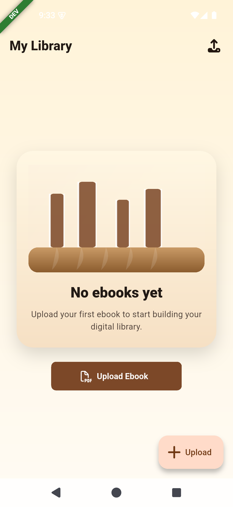
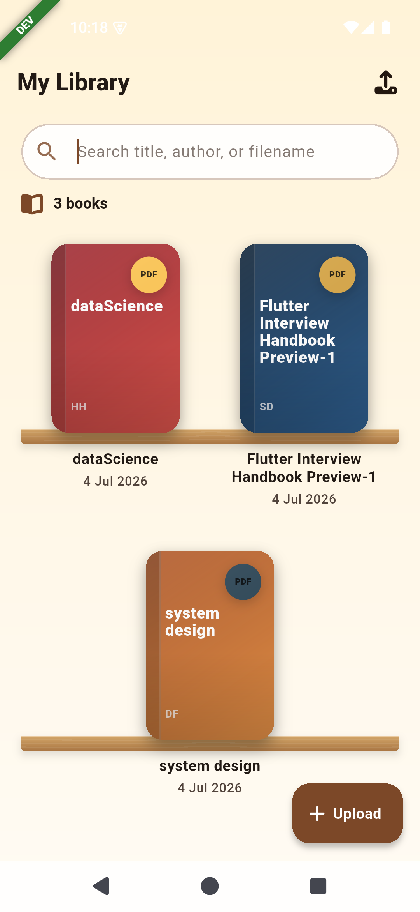
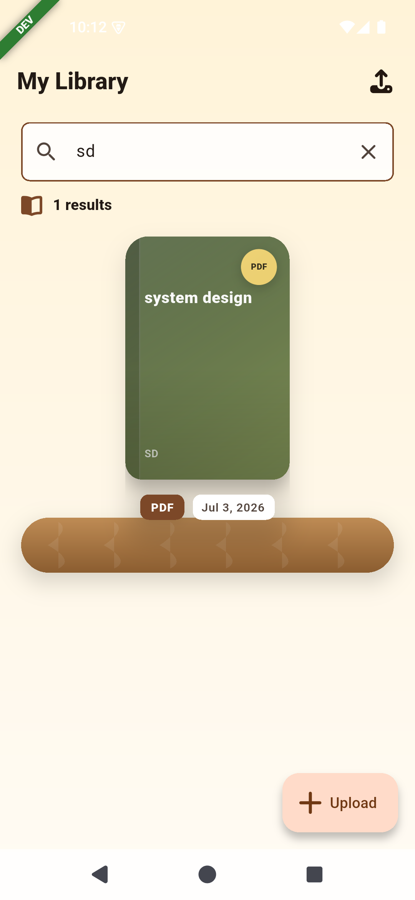
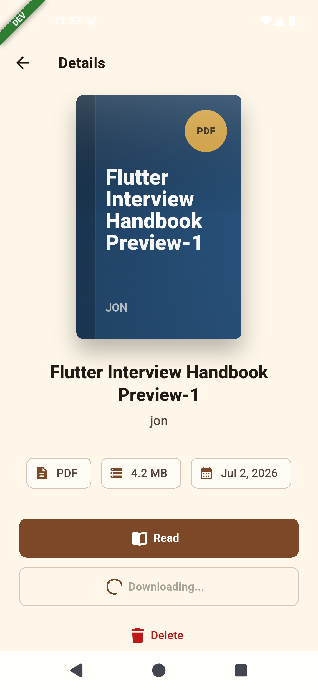
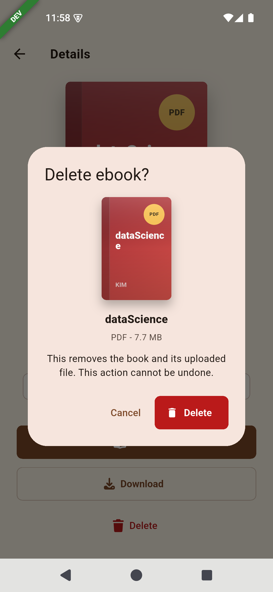
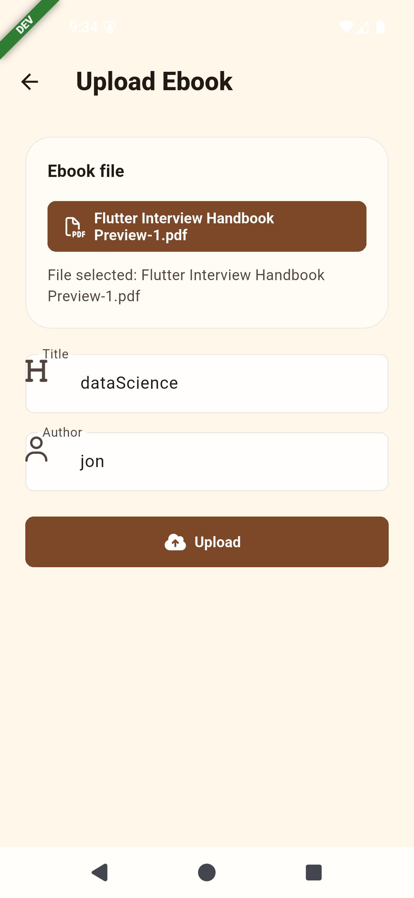
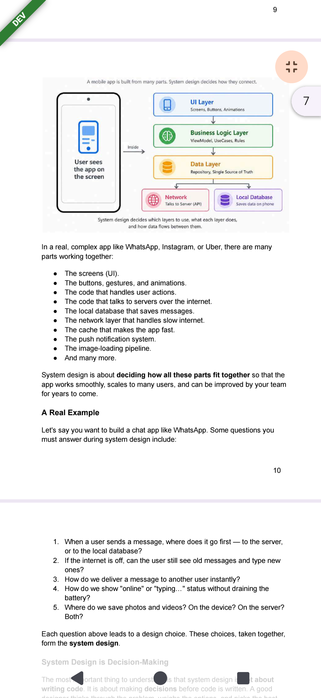

# Digital Ebook Library

A production-minded ebook library assignment built with a Rails API backend and a Flutter client using feature-first Clean Architecture, BLoC, GetIt, Dio, AutoRoute, and a polished bookshelf experience.

## Highlights

- Bookshelf-style library inspired by classic iOS ebook shelves
- PDF upload with metadata, validation, progress, and success/error states
- Debounced search by title, author, and filename
- Ebook detail view with read, download, and delete actions
- Syncfusion PDF reader with page navigation, zoom, fullscreen, and last-page memory
- Dev, staging, and prod flavors with separate app names and API base URLs
- Rails API-ready networking with Dio interceptors, error mapping, and `Either<Failure, T>`
- Widget and BLoC test structure using `flutter_test`, `bloc_test`, and `mocktail`

## Tech Stack

Frontend:

- Flutter / Material 3
- `flutter_bloc`, `equatable`
- `dartz` for `Either`-based failure handling
- `dio` with request/response/error logging
- `get_it` for dependency injection
- `go_router` for navigation
- `freezed_annotation`, `json_annotation`, `json_serializable`, `build_runner`
- `file_picker`, `syncfusion_flutter_pdfviewer`, `path_provider`, `permission_handler`
- `font_awesome_flutter` for icons
- `shimmer`, `cached_network_image`

Backend:

- Ruby on Rails API
- PostgreSQL
- Active Storage
- RSpec request specs

## Architecture

The Flutter client follows feature-first Clean Architecture:

```text
frontend/lib/
├── core/
│   ├── network/
│   ├── error/
│   ├── constants/
│   ├── services/
│   ├── theme/
│   ├── widgets/
│   ├── extensions/
│   └── utils/
├── features/
│   └── ebook/
│       ├── data/
│       │   ├── datasources/
│       │   ├── models/
│       │   └── repositories/
│       ├── domain/
│       │   ├── entities/
│       │   ├── repositories/
│       │   └── usecases/
│       └── presentation/
│           ├── bloc/
│           ├── pages/
│           ├── widgets/
│           └── states/
├── di/
├── router/
├── flavor/
└── main.dart
```

📸 Screenshots

<table>
  <tr>
    <td></td>
    <td></td>
    <td></td>
  </tr>
  <tr>
    <td></td>
    <td></td>
    <td></td>
  </tr>
  <tr>
    <td></td>
  </tr>
</table>

Layering:

- Presentation owns pages, widgets, animations, and BLoC events/states.
- Domain owns entities, repository contracts, and use cases.
- Data owns Dio datasources, API models, mock support, and repository implementations.
- Core owns cross-cutting concerns such as failures, logging, theme, file picking, and utilities.

## Prerequisites

- Flutter SDK 3.x (or later) and Dart
- Ruby 3.x with Bundler
- PostgreSQL 12+
- Android emulator or physical device (for Android testing)
- iOS simulator or device (for iOS testing; macOS required)

## Flavors

| Flavor  | App name              | Default API base URL                            | Banner |
| ------- | --------------------- | ----------------------------------------------- | ------ |
| dev     | Ebook Library Dev     | `http://10.0.2.2:3000`                          | Yes    |
| staging | Ebook Library Staging | `https://staging-api.ebook-library.example.com` | Yes    |
| prod    | Ebook Library         | `https://api.ebook-library.example.com`         | No     |

Override the API URL with:

```sh
--dart-define=API_BASE_URL=https://your-api.example.com
```

## Running

Backend:

```sh
cd backend
bundle install
bin/rails db:create db:migrate db:seed
bin/rails server
```

Frontend:

```sh
cd frontend
flutter pub get
dart run build_runner build --delete-conflicting-outputs
flutter run --flavor dev -t lib/main_dev.dart
```

During development, watch for code generation changes:

```sh
dart run build_runner watch --delete-conflicting-outputs
```

Other flavors:

```sh
flutter run --flavor staging -t lib/main_staging.dart
flutter run --flavor prod -t lib/main_prod.dart --release
```

**Note:** On Android emulator, the dev API defaults to `http://10.0.2.2:3000` (the host machine). Ensure the Rails server is running locally. On physical devices or iOS simulator, update `API_BASE_URL` via `--dart-define` or modify the flavor config.

## API Contract

The Flutter app is prepared for these Rails endpoints:

```text
GET    /api/ebooks
POST   /api/ebooks
GET    /api/ebooks/:id
GET    /api/ebooks/search?q=query
GET    /api/ebooks/:id/download
DELETE /api/ebooks/:id
```

Expected ebook payload:

```json
{
  "id": 1,
  "title": "Flutter Clean Architecture",
  "author": "Riya Sharma",
  "file_type": "application/pdf",
  "file_size": 13002342,
  "filename": "flutter-clean-architecture.pdf",
  "uploaded_at": "2026-06-28T10:00:00Z",
  "download_url": "/rails/active_storage/blobs/..."
}
```

Upload uses multipart form data:

```text
ebook[title]
ebook[author]
ebook[file]
```

## Testing

Frontend:

```sh
cd frontend
flutter test
flutter analyze
# Watch for test changes
flutter test --watch
```

Backend:

```sh
cd backend
bundle exec rspec
```

Covered frontend areas:

- Library loading states
- Ebook card rendering
- Empty bookshelf state
- Search bar clear action
- Delete confirmation dialog
- BLoC load/search/upload/delete flows

## Manual Testing Checklist

Use this checklist for the main user flows during assignment demo or review:

- Open the app and confirm the ebook library loads successfully.
- Upload a valid PDF and verify it appears in the library with the expected metadata.
- Try uploading a non-PDF file and confirm the validation error message is shown.
- Search for an ebook by title, author, or filename and verify the results update correctly.
- Open an ebook and confirm the download action is available.
- Delete an ebook and verify the confirmation dialog appears and the record is removed.
- Confirm the empty-state screen appears when no ebooks are available.
